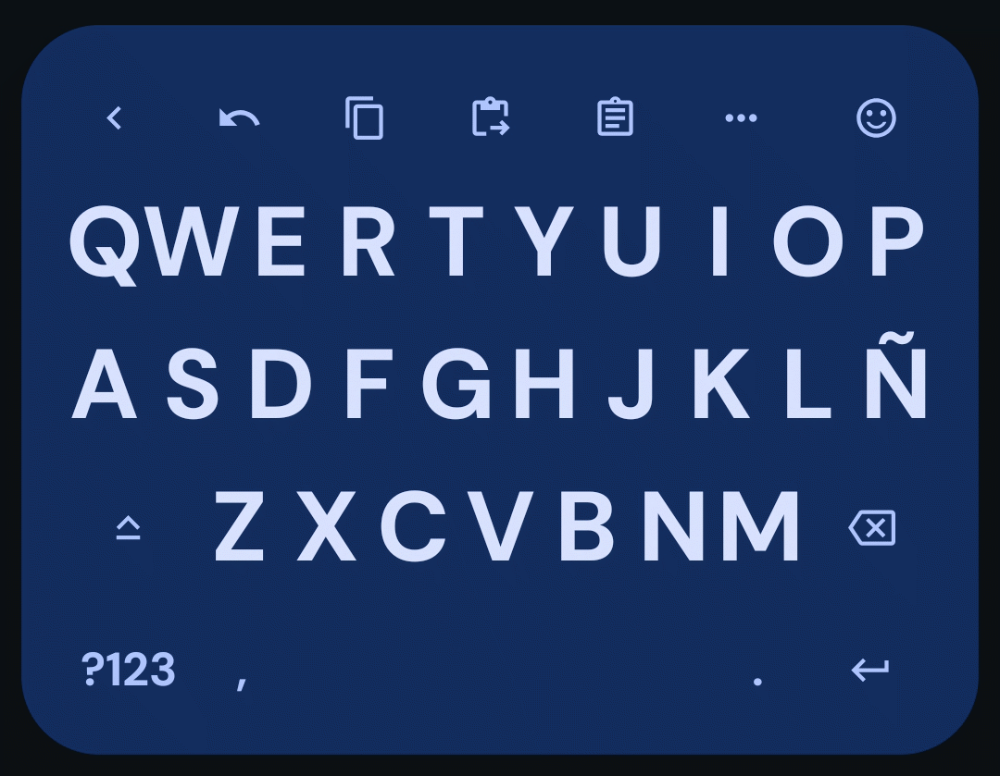
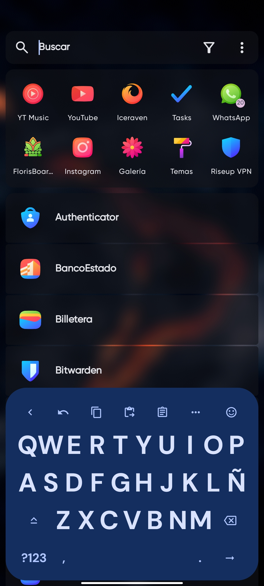
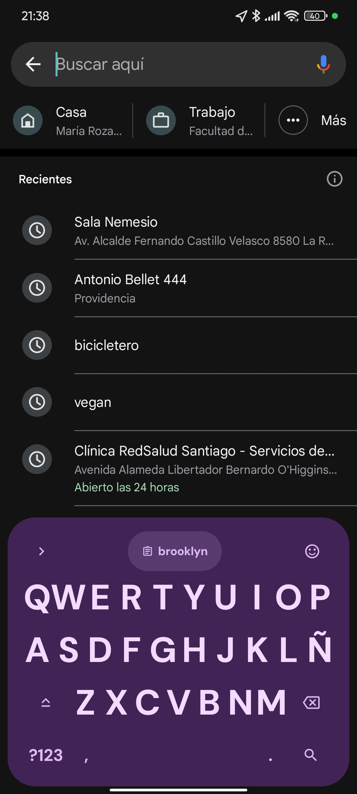
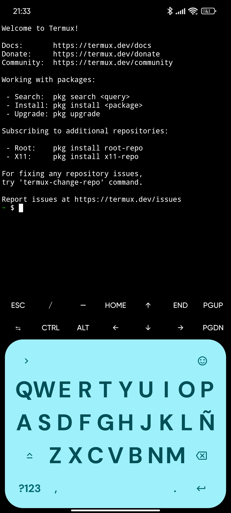
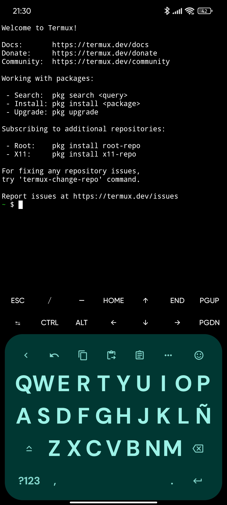

# Materialist: Theme for FlorisBoard

This is a custom FlorisBoard theme created using the built-in theme editor.
The exported `.flex` file represents the full source of the theme.

## Installation
Import the `.flex` file in FlorisBoard via:
Settings → Theme → Import

# Screenshots

  
  
  

  
  

## License
This theme is released under the MIT License.

## Support

If you find this theme useful and would like to support my work, a small donation or a follow on Instagram is always appreciated.
https://www.instagram.com/svntivndrev/

## Note
This theme was created as a free community contribution. Commercial redistribution is discouraged, and attribution or support is always appreciated.
